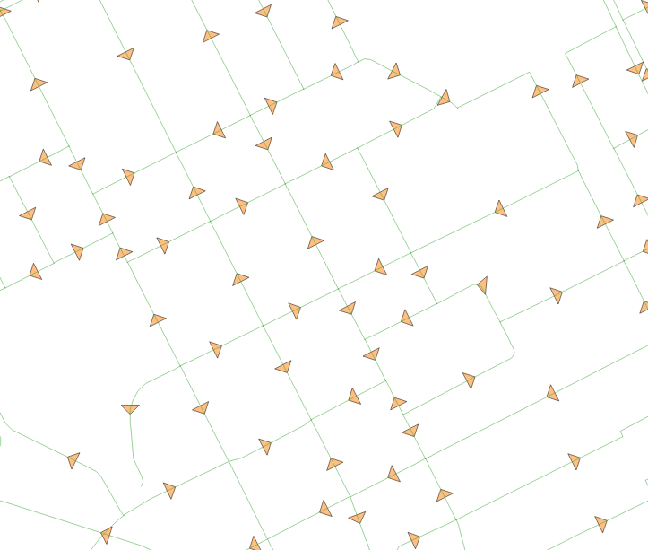
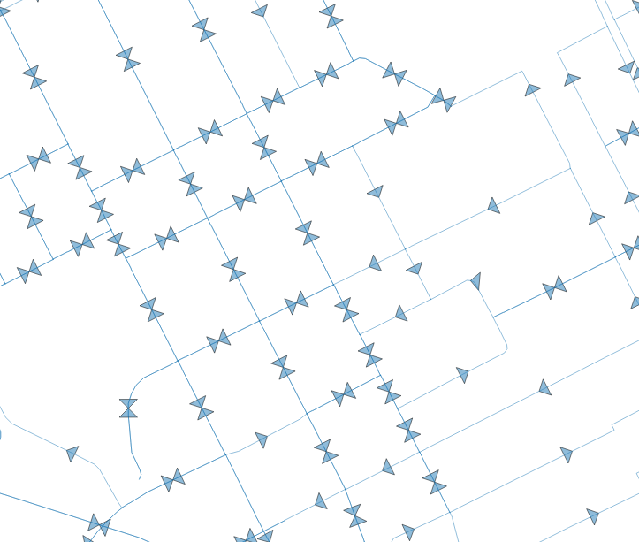
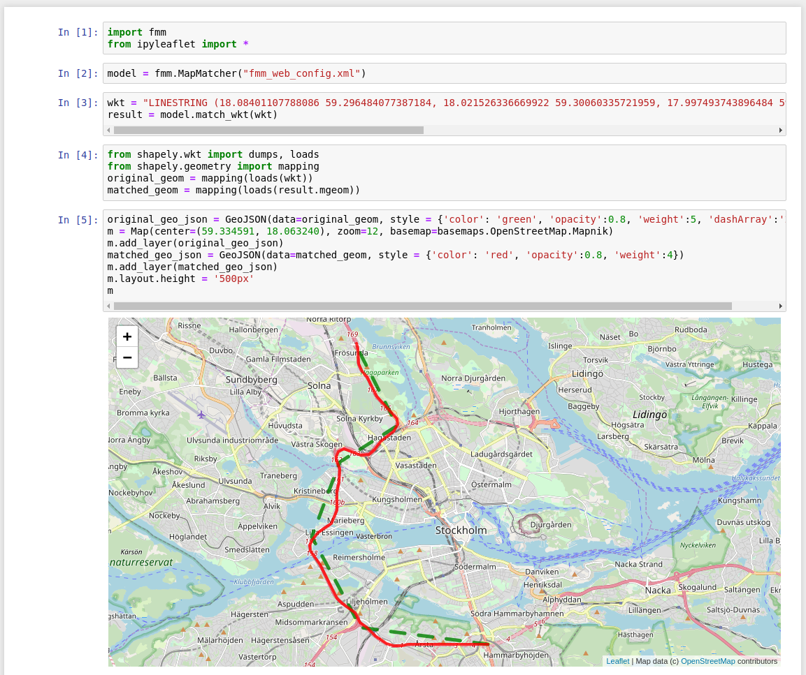

# Map matching on OpenStreetMap, a practical tutorial

### Demonstration

 

### Content

- [1. Download routable network from OSM](#1-download-routable-network-from-osm)
- [2. Preprocess road network using PostGIS](#2-preprocess-road-network-using-postgis)
    - [2.1 Import network into PostGIS database](#21-import-network-into-postgis-database)
    - [2.2 Complement bidirectional edges](#22-complement-bidirectional-edges)
    - [2.3 Export network as shapefile](#23-export-network-as-shapefile)
- [3. Run map matching with fmm](#3-run-map-matching-with-fmm)
    - [3.1 Preprocessing of fmm](#31-preprocessing-of-fmm)
    - [3.2 Run web demo](#32-run-web-demo)
    - [3.3 Run jupyter notebook](#33-run-jupyter-notebook)

### Tools used

- [OSMNX](https://github.com/gboeing/osmnx) for downloading OSM data
- [PostGIS database](https://postgis.net/) for preprocessing
- [Fast map matching program (Python extension)](https://github.com/cyang-kth/fmm) for map matching

### 1. Download routable network from OSM

[OSMNX](https://github.com/gboeing/osmnx) provides a convenient way to download a routable shapefile directly in python.

Download by place name
```
import osmnx as ox
place ="Stockholm, Sweden"
G = ox.graph_from_place(place, network_type='drive',which_result=2)
ox.save_graph_shapefile(G, filename='stockholm')
```

Download by a boundary polygon in geojson

```
import osmnx as ox
from shapely.geometry import shape
json_file = open("stockholm_boundary.geojson")
import json
data = json.load(json_file)
boundary_polygon = shape(data["features"][0]['geometry'])
G = ox.graph_from_polygon(boundary_polygon, network_type='drive')
ox.save_graph_shapefile(G, filename='stockholm')
```

In the second manner, here is a screenshot of the network in QGIS.


### 2. Preprocess road network using PostGIS

Although the network shapefile contains topology information (from, to), these information cannot be directly used in fmm. We need to preprocess the data
1. relabel the `from`, `to` attribute from the original OSM id to smaller integers
2. Duplicate bidirectional edges, i.e., add a reverse edge if an edge's `oneway` equals `False`.  

The two tasks can be done in PostGIS using the following code

#### 2.1 Import network into PostGIS database

Before you import the shapefile into PostGIS database. You need to create a new database or use an existing one.
Following the [instructions](http://www.postgresqltutorial.com/postgresql-create-database/). It is highly recommended to use PgAdmin3.


We use shp2pgsql for importing the shapefile into a PostGIS database called `mm_db`, run the following code in **bash shell**.
(You may replace the user name `postgres` and database name `mm_db` with your own settings.)

```
# Create a schema called network
psql -U postgres -d mm_db -c "CREATE SCHEMA network;"
# Import the downloaded edges and nodes shapefile.
shp2pgsql data/stockholm/edges/edges.shp network.original_edges | psql -U postgres -d mm_db
shp2pgsql data/stockholm/nodes/nodes.shp network.original_nodes | psql -U postgres -d mm_db
```

#### 2.2 Complement bidirectional edges

Execute the following commands in `psql` or PgAdmin. Type `psql -U postgres -d mm_db` in bash shell to open the psql.

```

-- Add two columns in the original network to store the new IDs.

ALTER TABLE network.original_edges ADD COLUMN source int;
ALTER TABLE network.original_edges ADD COLUMN target int;

-- Update the columns by joining with the original_nodes table

UPDATE network.original_edges AS a
SET source = b.gid
FROM network.original_nodes AS b
WHERE a.from = b.osmid;

UPDATE network.original_edges AS a
SET target = b.gid
FROM network.original_nodes AS b
WHERE a.to = b.osmid;

-- Create a new table to include the dual edges
CREATE TABLE network.dual
(
  gid serial NOT NULL,
  geom geometry(LineString),
  source integer,
  target integer,
  CONSTRAINT dual_pkey PRIMARY KEY (gid)
);

-- Insert original edges

INSERT INTO
    network.dual (geom,source,target)
SELECT ST_LineMerge(geom),source,target FROM network.original_edges;

-- Insert reverse edges whose oneway equals false

INSERT INTO
    network.dual (geom,source,target)
SELECT ST_Reverse(ST_LineMerge(geom)),target,source FROM network.original_edges where oneway='False';
```

#### 2.3 Export network as shapefile

Run the code in **bash shell**

```
pgsql2shp -f data/stockholm/network_dual.shp -h localhost -u postgres -d mm_db "SELECT gid::integer as id,source,target,geom from network.dual"
```

You can see the difference between the original network (left) and the new network (right).

 

### 3. Run map matching with fmm

Install the [**fmm** program](https://github.com/cyang-kth/fmm) in **C++ and Python** extension following the [instructions](https://github.com/cyang-kth/fmm/wiki).

#### 3.1 Preprocessing of fmm

The precomputation program `ubodt_gen_omp` creates an upperbounded OD table (UBODT) to accelerate the map matching process. Run the `ubodt_gen_omp` program in **bash shell**.

```
    mkdir output
    ubodt_gen_omp ubodt_config.xml
```

It will generate a binary file `ubodt.bin` under the output directory.

```
    ls -hl output/ubodt.bin
    833MB output/ubodt.bin
```

Here binary format is selected to increase the reading speed in fmm.

#### 3.2 Run web demo

Install the dependencies with

```
pip install tornado flask numpy
```

After the Python extension of fmm is installed, run the web demo of `fmm` using the provided [configuration file](fmm_web_config.xml). More information about the configuration can be found at the [fmm wiki](https://github.com/cyang-kth/fmm/wiki/Configuration).

```
    python FMM_DIR/web_demo/fmm_web_app.py -c fmm_web_config.xml
```

Visit [http://localhost:5000/demo](http://localhost:5000/demo) to open the drawing tools where you can draw a trajectory and it will be matched to the OSM, as shown below.

 

#### 3.3 Run jupyter notebook

Check the [demo.ipynb](demo.ipynb) as an example ([ipyleaflet](https://github.com/jupyter-widgets/ipyleaflet),[shapely](https://github.com/Toblerity/Shapely) is needed.).



### Contact information

Can Yang, Ph.D. student at KTH, Royal Institute of Technology in Sweden

Email: cyang(at)kth.se

Homepage: https://people.kth.se/~cyang/
